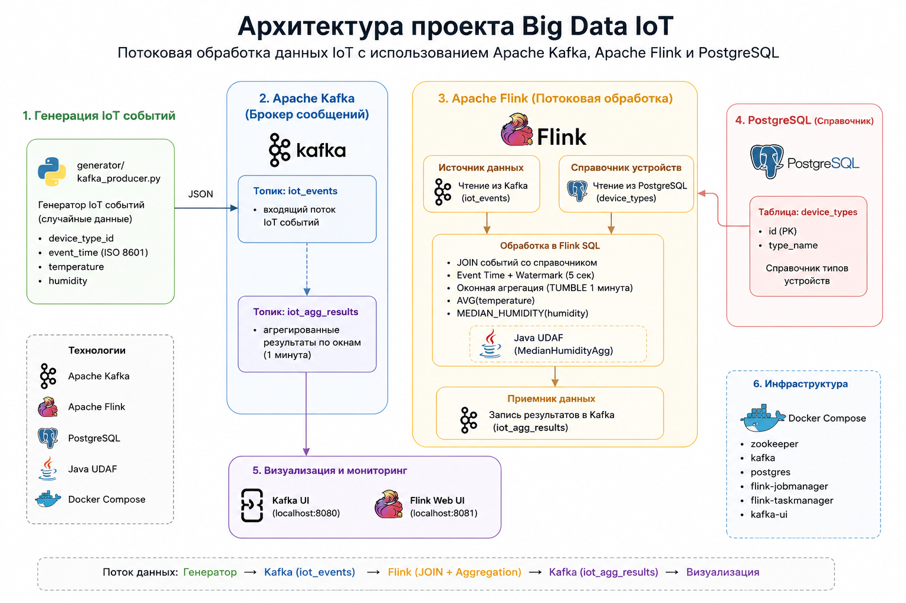
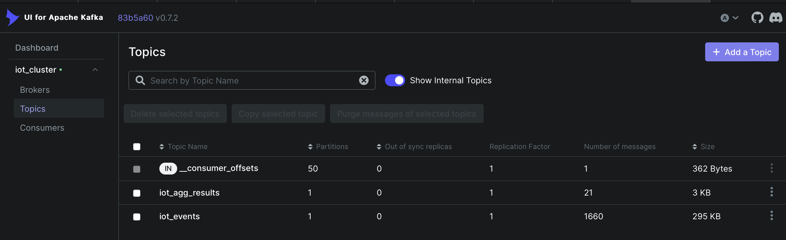
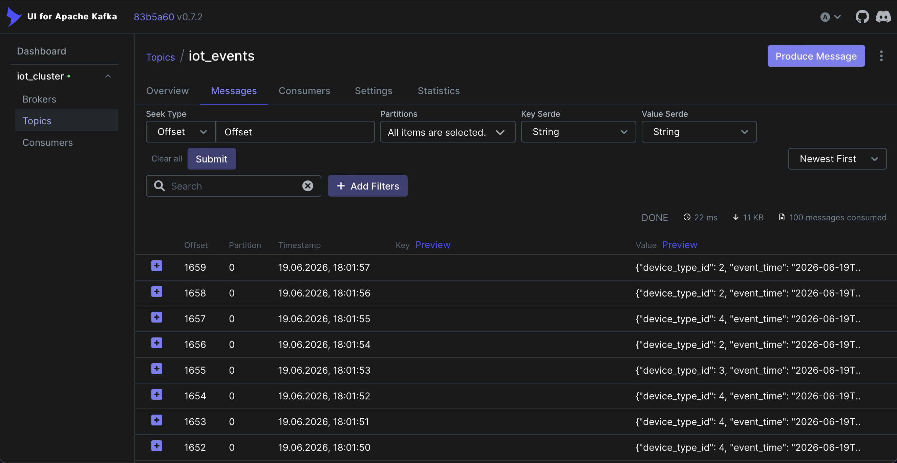
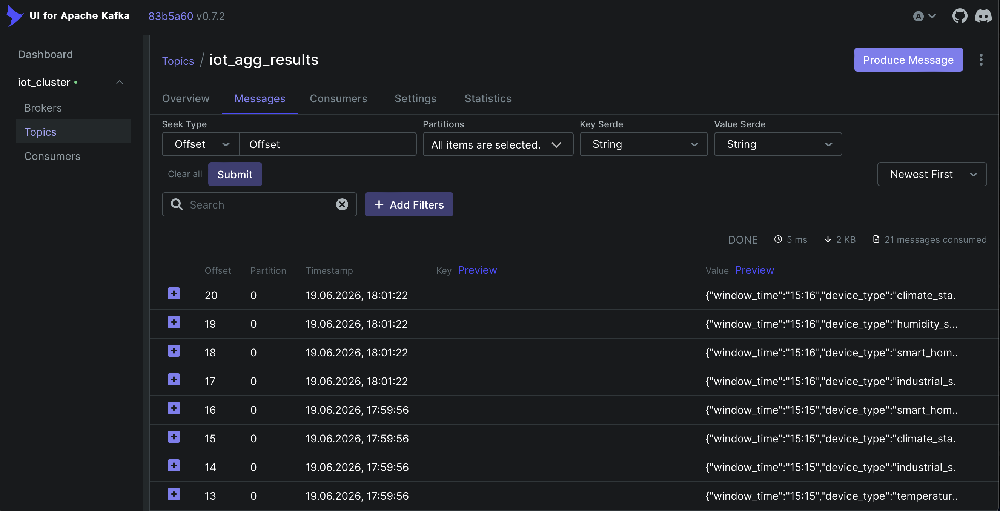
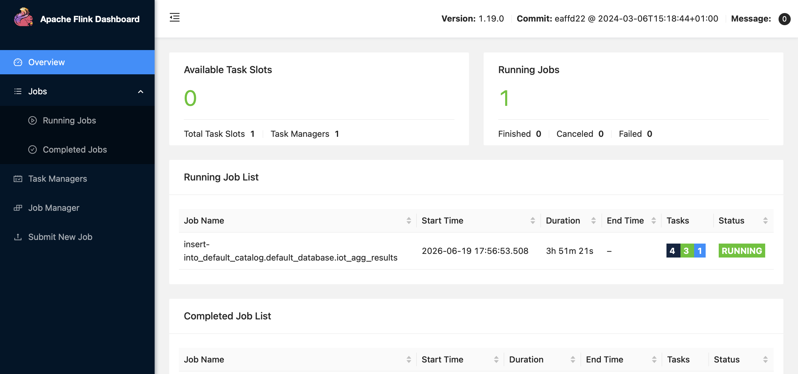
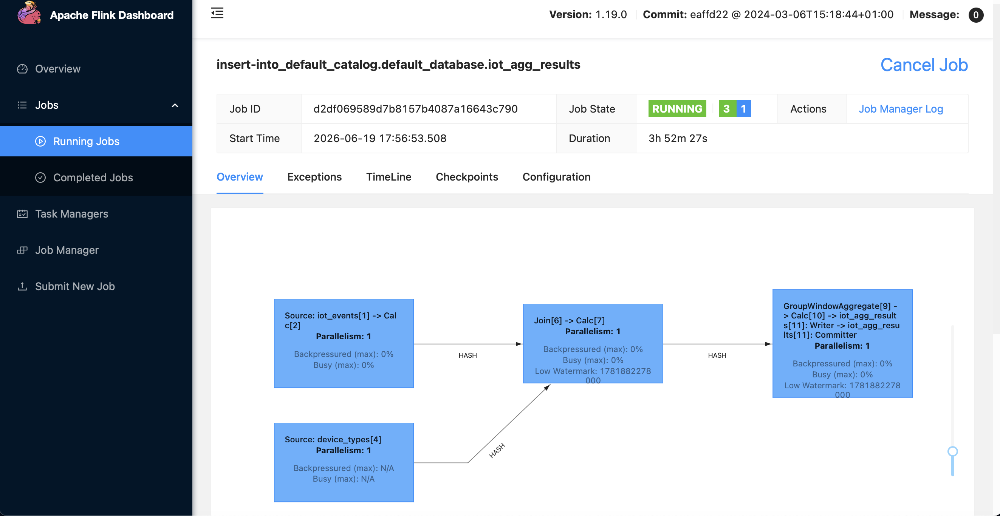

# Big Data IoT Streaming Project
#### prepared by Viktoria Karpeykina

## 1. Описание проекта

Проект реализует потоковую обработку сообщений от IoT-устройств.

Система генерирует события от IoT-устройств раз в секунду, публикует их в Kafka, затем Apache Flink читает поток, соединяет события со справочником типов устройств из PostgreSQL, рассчитывает агрегаты по минутным окнам в event time и сохраняет результат обратно в Kafka.

Итоговый результат для каждой минуты и каждого типа устройства:

- время окна в формате `HH:mm`;
- тип устройства из PostgreSQL-справочника;
- средняя температура;
- медиана влажности.

## 2. Архитектура




```text
IoT generator
    ↓
Kafka topic: iot_events
    ↓
Apache Flink SQL / Table API
    ↓
Join with PostgreSQL device_types
    ↓
Event Time + Watermark
    ↓
1-minute Tumbling Window
    ↓
AVG(temperature) + Java UDAF MEDIAN(humidity)
    ↓
Kafka topic: iot_agg_results
```

## 3. Технологии

- Python 3.11
- Docker Compose
- Apache Kafka
- Kafka UI
- PostgreSQL
- Apache Flink 1.19
- PyFlink Table API / SQL API
- Java UDAF для точной медианы
- Maven для сборки Java UDAF

## 4. Структура репозитория

```text
big-data-iot-project-vk/
│
├── docker-compose.yml
├── requirements.txt
├── README.md
├── pics
│
├── sql/
│   ├── ddl.sql
│   └── dml.sql
│
├── generator/
│   └── iot_producer.py
│
├── flink_job/
│   ├── iot_final_job.py
│   └── median-udaf-1.0.0.jar
│
└── java_udaf/
    ├── pom.xml
    ├── src/main/java/com/hse/bigdata/MedianHumidityAgg.java
    └── target/median-udaf-1.0.0.jar

```

## 5. Описание основных файлов

### `docker-compose.yml`

Поднимает инфраструктуру проекта:

- PostgreSQL;
- Zookeeper;
- Kafka;
- Kafka UI;
- Flink JobManager;
- Flink TaskManager.

Kafka доступна локально на `localhost:9092`, а внутри Docker-сети на `iot_kafka:29092`.

PostgreSQL доступен внутри Docker-сети как `iot_postgres:5432`.

### `sql/ddl.sql`

Создаёт таблицу-справочник типов IoT-устройств:

```sql
DROP TABLE IF EXISTS device_types;

CREATE TABLE device_types (
    id INTEGER PRIMARY KEY,
    type_name VARCHAR(100) NOT NULL
);
```

### `sql/dml.sql`

Наполняет справочник тестовыми типами устройств:

```sql
INSERT INTO device_types (id, type_name) VALUES
(1, 'temperature_sensor'),
(2, 'humidity_sensor'),
(3, 'climate_station'),
(4, 'industrial_sensor'),
(5, 'smart_home_sensor');
```

### `generator/iot_producer.py`

Python-генератор IoT-событий.

Раз в секунду отправляет сообщение в Kafka topic `iot_events`.

Пример входного сообщения:

```json
{
  "device_type_id": 3,
  "event_time": "2026-06-18T22:26:29.038601+00:00",
  "temperature": 34.86,
  "humidity": 68.54
}
```

### `flink_job/iot_final_job.py`

Основной Flink job.

Он выполняет полный пайплайн:

1. Читает поток из Kafka topic `iot_events`;
2. Преобразует строковое поле `event_time` в event-time timestamp;
3. Задаёт watermark с допустимым опозданием в max 5 секунд;
4. Читает справочник `device_types` из PostgreSQL через JDBC;
5. Соединяет поток событий со справочником;
6. Группирует события по минутному tumbling window и типу устройства;
7. Считает среднюю температуру через `AVG`;
8. Считает медиану влажности через Java UDAF `MEDIAN_HUMIDITY`;
9. Записывает результат в Kafka topic `iot_agg_results`.

### `java_udaf/src/main/java/com/hse/bigdata/MedianHumidityAgg.java`

Java UDAF для точного расчёта медианы влажности.

Flink SQL не поддерживает `PERCENTILE_CONT` в используемой сборке, поэтому медиана реализована как пользовательская функция:

1. Значения влажности внутри окна сохраняются в аккумулятор;
2. Список сортируется;
3. Если количество значений нечётное, берётся центральное значение;
4. Если количество значений чётное, берётся среднее двух центральных.

### `java_udaf/pom.xml`

Maven-конфигурация для сборки JAR-файла с Java UDAF.

## 6. Формат данных

### Входной Kafka topic: `iot_events`

```json
{
  "device_type_id": 3,
  "event_time": "2026-06-18T22:26:29.038601+00:00",
  "temperature": 34.86,
  "humidity": 68.54
}
```

Поля:

- `device_type_id` — идентификатор типа устройства;
- `event_time` — время события;
- `temperature` — температура;
- `humidity` — влажность.

### PostgreSQL table: `device_types`

```text
id | type_name
---|--------------------
1  | temperature_sensor
2  | humidity_sensor
3  | climate_station
4  | industrial_sensor
5  | smart_home_sensor
```

### Выходной Kafka topic: `iot_agg_results`

```json
{
  "window_time": "15:14",
  "device_type": "smart_home_sensor",
  "avg_temperature": 21.46,
  "median_humidity": 82.17
}
```

Поля:

- `window_time` — начало минутного окна в формате `HH:mm`;
- `device_type` — название типа устройства из PostgreSQL;
- `avg_temperature` — средняя температура за минуту;
- `median_humidity` — медиана влажности за минуту.

## 7. Как запустить проект

### Шаг 1. Запустить инфраструктуру

```bash
docker compose up -d
```

Проверить контейнеры:

```bash
docker ps
```

Должны быть запущены:

```text
iot_postgres
iot_zookeeper
iot_kafka
iot_kafka_ui
iot_flink_jobmanager
iot_flink_taskmanager
```

### Шаг 2. Создать Kafka topics

```bash
docker exec -it iot_kafka kafka-topics \
  --bootstrap-server iot_kafka:29092 \
  --create \
  --if-not-exists \
  --topic iot_events \
  --partitions 1 \
  --replication-factor 1
```

```bash
docker exec -it iot_kafka kafka-topics \
  --bootstrap-server iot_kafka:29092 \
  --create \
  --if-not-exists \
  --topic iot_agg_results \
  --partitions 1 \
  --replication-factor 1
```

Проверка:

```bash
docker exec -it iot_kafka kafka-topics \
  --bootstrap-server iot_kafka:29092 \
  --list
```

### Шаг 3. Проверить PostgreSQL-справочник

```bash
docker exec -it iot_postgres psql \
  -U iot_user \
  -d iot_db \
  -c "SELECT * FROM device_types;"
```

Ожидаемый результат:

```text
 id |      type_name
----+----------------------
  1 | temperature_sensor
  2 | humidity_sensor
  3 | climate_station
  4 | industrial_sensor
  5 | smart_home_sensor
```

### Шаг 4. Собрать Java UDAF для медианы

Если JAR уже есть в `java_udaf/target/median-udaf-1.0.0.jar`, этот шаг можно пропустить.

Сборка через Docker:

```bash
docker run --rm \
  -v "$PWD/java_udaf":/app \
  -w /app \
  maven:3.9.6-eclipse-temurin-11 \
  mvn clean package
```

После сборки должен появиться файл:

```text
java_udaf/target/median-udaf-1.0.0.jar
```

### Шаг 5. Подключить Java UDAF к Flink

Скопировать JAR в оба Flink-контейнера:

```bash
docker cp java_udaf/target/median-udaf-1.0.0.jar \
  iot_flink_jobmanager:/opt/flink/lib/
```

```bash
docker cp java_udaf/target/median-udaf-1.0.0.jar \
  iot_flink_taskmanager:/opt/flink/lib/
```

Перезапустить Flink:

```bash
docker restart iot_flink_jobmanager iot_flink_taskmanager
```

### Шаг 6. Подключить Flink connectors

Если после перезапуска Flink не видит Kafka/JDBC connector, нужно скачать JAR-файлы в оба контейнера.

Kafka SQL connector:

```bash
docker exec -it iot_flink_jobmanager bash -lc "
cd /opt/flink/lib &&
curl -O https://repo.maven.apache.org/maven2/org/apache/flink/flink-sql-connector-kafka/3.2.0-1.19/flink-sql-connector-kafka-3.2.0-1.19.jar
"
```

```bash
docker exec -it iot_flink_taskmanager bash -lc "
cd /opt/flink/lib &&
curl -O https://repo.maven.apache.org/maven2/org/apache/flink/flink-sql-connector-kafka/3.2.0-1.19/flink-sql-connector-kafka-3.2.0-1.19.jar
"
```

JDBC connector и PostgreSQL driver:

```bash
docker exec -it iot_flink_jobmanager bash -lc "
cd /opt/flink/lib &&
curl -O https://repo.maven.apache.org/maven2/org/apache/flink/flink-connector-jdbc/3.2.0-1.19/flink-connector-jdbc-3.2.0-1.19.jar &&
curl -O https://repo.maven.apache.org/maven2/org/postgresql/postgresql/42.7.3/postgresql-42.7.3.jar
"
```

```bash
docker exec -it iot_flink_taskmanager bash -lc "
cd /opt/flink/lib &&
curl -O https://repo.maven.apache.org/maven2/org/apache/flink/flink-connector-jdbc/3.2.0-1.19/flink-connector-jdbc-3.2.0-1.19.jar &&
curl -O https://repo.maven.apache.org/maven2/org/postgresql/postgresql/42.7.3/postgresql-42.7.3.jar
"
```

После копирования JAR-файлов:

```bash
docker restart iot_flink_jobmanager iot_flink_taskmanager
```

### Шаг 7. Установить Python-зависимость для PyFlink CLI

В некоторых окружениях PyFlink внутри контейнера требует `ruamel.yaml`:

```bash
docker exec -it iot_flink_jobmanager bash -lc \
  "apt-get update && apt-get install -y python3 python3-pip && python3 -m pip install ruamel.yaml"
```

```bash
docker exec -it iot_flink_taskmanager bash -lc \
  "apt-get update && apt-get install -y python3 python3-pip && python3 -m pip install ruamel.yaml"
```

### Шаг 8. Запустить генератор IoT-событий

Локально создать виртуальное окружение:

```bash
python3.11 -m venv .venv
source .venv/bin/activate
pip install kafka-python==2.0.2 psycopg2-binary==2.9.9
```

Запустить producer:

```bash
python generator/iot_producer.py
```

Он будет отправлять события в `iot_events` раз в секунду.

### Шаг 9. Запустить финальный Flink job

В отдельном терминале:

```bash
docker exec -it iot_flink_jobmanager flink run \
  -pyclientexec python3 \
  -pyexec python3 \
  -py /opt/flink/usrlib/iot_final_job.py
```

### Шаг 10. Проверить результат

```bash
docker exec -it iot_kafka kafka-console-consumer \
  --bootstrap-server iot_kafka:29092 \
  --topic iot_agg_results \
  --from-beginning
```

Пример результата:

```json
{"window_time":"15:14","device_type":"humidity_sensor","avg_temperature":20.826666666666664,"median_humidity":47.11}
{"window_time":"15:14","device_type":"climate_station","avg_temperature":21.26,"median_humidity":76.935}
{"window_time":"15:14","device_type":"smart_home_sensor","avg_temperature":21.46,"median_humidity":82.17}
```

## 8. UI для проверки

### Kafka UI

```text
http://localhost:8080
```

Можно проверить топики:




- `iot_events`;
- `iot_agg_results`.


Поток сырых IoT-событий, генерируемых producer'ом и поступающих в Kafka ЕЖЕСЕКУНДНО:




Результат обработки во Flink: обогащение данных, оконная агрегация и вычисление средней температуры и медианы влажности (ЕЖЕМИНУТНО):




### Flink UI

```text
http://localhost:8081
```

Можно проверить:



- запущенные jobs;
- failed jobs;
- exceptions;
- статус TaskManager.


Граф выполнения потокового конвейера во Flink:




## 9. Как посмотреть логи

JobManager:

```bash
docker logs -f iot_flink_jobmanager
```

TaskManager:

```bash
docker logs -f iot_flink_taskmanager
```

Последние строки:

```bash
docker logs --tail 300 iot_flink_taskmanager
```

## 10. Итоговая реализация

| Требование | Где реализовано |
|---|---|
| Генератор сообщений раз в секунду | `generator/iot_producer.py` |
| Kafka input topic | `iot_events` |
| PostgreSQL-справочник | `sql/ddl.sql`, `sql/dml.sql` |
| Kafka source во Flink | `flink_job/iot_final_job.py`, таблица `iot_events` |
| PostgreSQL source во Flink | `flink_job/iot_final_job.py`, таблица `device_types` через JDBC |
| Join Kafka + PostgreSQL | `JOIN device_types ON device_type_id = id` |
| Event time | вычисляемое поле `event_ts` |
| Watermark | `WATERMARK FOR event_ts AS event_ts - INTERVAL '5' SECOND` |
| Окно 1 минута | `TUMBLE(e.event_ts, INTERVAL '1' MINUTE)` |
| Средняя температура | `AVG(e.temperature)` |
| Медиана влажности | Java UDAF `MEDIAN_HUMIDITY(e.humidity)` |
| Kafka sink | таблица `iot_agg_results` |
| SQL/Table API | весь финальный Flink job реализован через `StreamTableEnvironment` и SQL |
| Переход между API | основной пайплайн использует Table API |

## 11. С какими проблемами столкнулись

Во время реализации были проверены несколько способов расчёта медианы:

1. `PERCENTILE_CONT(0.5)` — в используемой сборке Flink SQL не поддерживался.
2. SQL-реализация через `ROW_NUMBER()` — не подошла для streaming mode, так как `OVER`-окно требует ordering по time attribute.
3. Python UDAF / Python DataStream API — потребовали полноценный PyFlink Beam runtime внутри Docker-контейнера, что оказалось нестабильно для стандартного образа Flink.
4. Итоговое решение — Java UDAF, подключённый как JAR к Flink SQL.

Итоговое решение через Java UDAF оказалось стабильным и соответствует архитектуре задания: весь расчёт выполняется внутри Flink, а результат сохраняется в Kafka.

## 12. Как остановить проект

```bash
docker compose down
```

Если нужно удалить тома и полностью пересоздать состояние:

```bash
docker compose down -v
```

## 13. Что можно улучшить

- вынести загрузку connector JAR-файлов в собственный Dockerfile для Flink;
- добавить автоматическое создание Kafka topics;
- добавить отдельный `scripts/` каталог с командами запуска;
- добавить unit-тест для Java UDAF.
